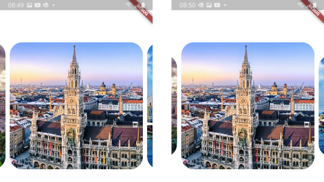
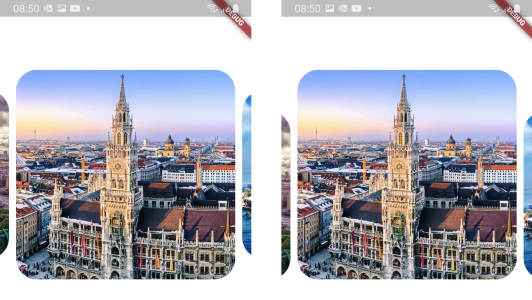

# Carousel Images

Carousel of images with reality (parallax) effect


## How to use

CarouselImages widget support Network and Asset Images. You should put to list path or url:
```
final List<String> listImages = [
  'assets/1.jpg',
  'https://www.factroom.ru/wp-content/uploads/2019/04/5-sobiraetes-syuda-priekhat.jpg',
  'https://cdn.flixbus.de/2018-01/munich-header-d8_0.jpg',
  'assets/4.jpg',
  'assets/5.jpg',
  ];'
```
```
CarouselImages(
  scaleFactor: 0.6,
  listImages: listImages,
  height: 300.0,
  borderRadius: 30.0,
  cachedNetworkImage: true,
  verticalAlignment: Alignment.topCenter,
  onTap: (index){
    print('Tapped on page $index');
  },
)
```

Parameter **height** is required!

Use **cachedNetworkImage** to cache images from network.

Use **scaleFactor** to give scale size of nearby images.


Use **verticalAlignment** to place nearby images in right position.


